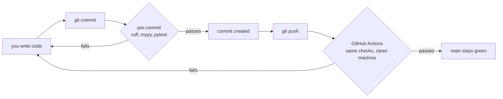
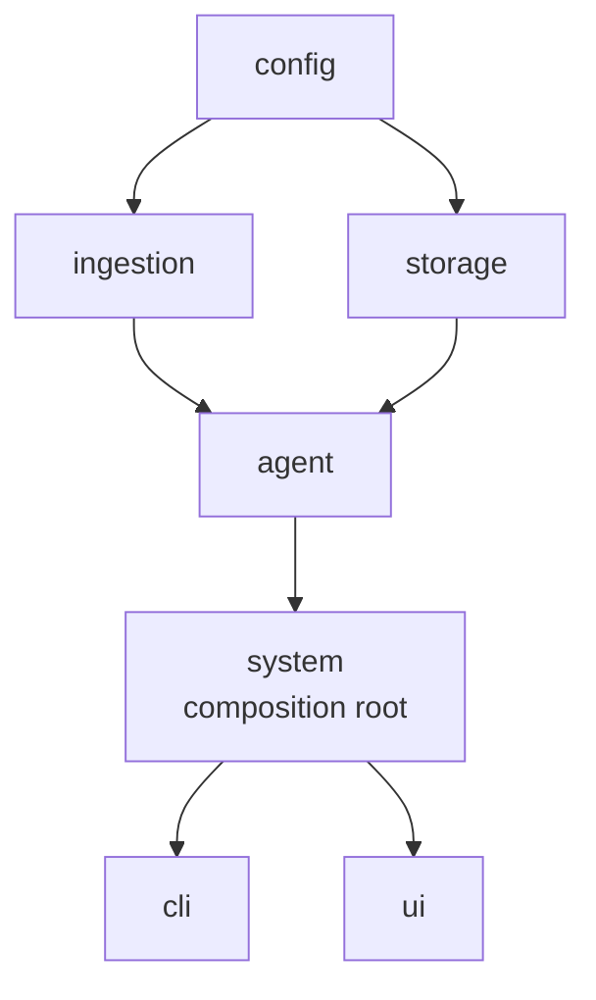

# Stage 0 — Skeleton, Tooling & Typed Configuration

> **Where we are:** the repository now checks itself — it lints, type-checks and tests on every
> commit — and it has one validated place where every setting in the system lives. There is no RAG
> behaviour yet; that starts in Stage 1.

---

## 1. Why start with tooling instead of features?

It is tempting to write `chunker.py` on day one. Here is why we didn't.

Every later stage in this project is *hard to eyeball*. When a chunking function quietly produces a
chunk 200 characters too long, or a graph node reads a state key that was never set, nothing
crashes — you get a slightly worse answer three stages later and no idea why. That class of bug is
expensive precisely because it is silent.

So Stage 0 buys **feedback**. From now on:

- `ruff` tells you within milliseconds if the code is malformed or has an obvious bug pattern.
- `mypy` tells you if you passed a `str` where a `Path` belongs, or read a field that doesn't exist.
- `pytest` tells you if logic you wrote last week still behaves.
- CI tells you all three on every push, on a clean machine, so "works on my laptop" can't hide.

The cost was about an hour. The alternative is debugging a silent retrieval bug at Stage 7 with no
safety net underneath you.

There is a second reason, specific to this project. The whole point of `self-correcting-rag` is a
system that checks its own work. It would be strange for the codebase not to.

---

## 2. What was created

```
pyproject.toml            project metadata, dependencies, and tool configuration
uv.lock                   the exact resolved version of all 148 packages
.python-version           pins Python to 3.12
.env.example              template for local secrets and overrides
.pre-commit-config.yaml   checks that run before a commit is allowed
.github/workflows/ci.yml  the same checks, on GitHub, on every push
README.md                 what the project is and how to run it
PLAN.md                   live progress tracker
src/self_rag/
  __init__.py             package version
  config.py               ← the real code of this stage
  cli.py                  the `self-rag` command
tests/
  conftest.py             shared fixtures (environment isolation)
  unit/test_config.py     18 tests
```

---

## 3. The build system: `pyproject.toml` + `uv`

### What problem does this solve?

If you have written Python before, you have probably done this:

```bash
pip install langchain qdrant-client gradio
pip freeze > requirements.txt
```

That breaks in two ways. First, `pip freeze` records what happened to be installed *on your
machine* — including packages you no longer use. Second, and worse, `requirements.txt` records
versions but not *why*: six months later nobody knows whether `qdrant-client==1.19.0` is a hard
requirement or just what pip grabbed that Tuesday.

`pyproject.toml` separates the two ideas:

```toml
dependencies = [
    "langchain>=1.4,<2",
    "qdrant-client>=1.15,<2",
    ...
]
```

This is a statement of **intent**: "this project needs some LangChain 1.x". It is human-written and
rarely changes.

`uv.lock` is the **resolution**: the exact version of every direct and transitive dependency, with
hashes. It is machine-written, committed to git, and guarantees that you, CI, and a teammate
install byte-identical packages.

> **Rule of thumb:** you edit `pyproject.toml`; `uv` writes `uv.lock`. Both go in git.

### Why `uv` and not `pip`?

`uv` is a dependency resolver and installer written in Rust. It resolved this project's 148
packages in **8.5 seconds**. The equivalent `pip` workflow takes minutes and has no lockfile at
all. It also manages Python itself — which mattered here, because:

### The Python version problem

This machine has **Python 3.14** installed system-wide. Several packages this project needs don't
have working builds for 3.14 yet. Rather than fight that, `.python-version` pins the project:

```
3.12
```

`uv` reads that file, downloads a private CPython 3.12 if needed, and builds the virtual
environment with it. Your system Python is untouched. This is why the first command in the README
is `uv sync` and not `pip install`.

We chose 3.12 specifically: 3.11 is the floor the reference implementation used, 3.13 risks missing
prebuilt wheels for the ONNX runtime, and 3.14 is ruled out above. **3.12 is the newest version
where everything has a ready-made wheel.**

### Optional dependencies and groups

Notice two things in `pyproject.toml`:

```toml
[project.optional-dependencies]
ui      = ["gradio>=6.26,<7"]
tracing = ["langfuse>=4.15,<5"]

[dependency-groups]
dev = ["pytest", "ruff", "mypy", "pre-commit", ...]
```

- **optional-dependencies** (`ui`, `tracing`) are features a *user* of the project might not want.
  Someone running only the command-line interface has no reason to install a web framework.
- **dependency-groups** (`dev`) are for people *working on* the project. They are never installed
  for end users.

This distinction keeps the production install small. It also documents the architecture: the fact
that Gradio is optional is a promise that nothing in the core imports it.

---

## 4. The quality gates

### Ruff — linter and formatter

Ruff does two separate jobs:

- **`ruff check`** looks for bug patterns: unused imports, shadowed variables, mutable default
  arguments, comparisons that are always true.
- **`ruff format`** rewrites your code into one canonical style.

Formatting matters more than it sounds. When everyone's code is formatted identically, a `git diff`
shows only *real* changes — no noise from someone's editor reindenting a file. Nobody argues about
line breaks in review because the tool already decided.

The rule sets we turned on:

```toml
select = ["E", "W", "F", "I", "N", "UP", "B", "C4", "SIM", "PTH", "RUF"]
```

Two are worth calling out. **`B`** (flake8-bugbear) catches genuine bug patterns — the classic
being a mutable default argument, where `def f(items=[])` shares *one* list across every call.
**`PTH`** pushes you from `os.path.join(a, b)` to `Path(a) / b`, which is harder to get wrong.

> **A real thing that happened:** the first `ruff format --check` run wanted to reformat
> `BLUEPRINT.md` and `IMPROVEMENTS.md`. Modern Ruff formats Python code blocks *inside Markdown*.
> But `BLUEPRINT.md` deliberately reproduces the reference implementation **verbatim** — that's its
> entire purpose. Reformatting it would defeat the document. So the config excludes Markdown:
>
> ```toml
> extend-exclude = ["*.md"]
> ```
>
> This is worth internalising: a tool being technically right doesn't make it right for your
> project. Tools serve the codebase, not the other way around.

### mypy — static type checking

Python doesn't check types at runtime, so this catches an entire category of bug before the code
ever runs:

```python
settings.data_dir.parent      # fine, Path has .parent
settings.llm_model.parent     # mypy: "str" has no attribute "parent"
```

We run it in `strict = true` mode, which requires annotations everywhere. Strict mode is much
easier to adopt on day one than to retrofit later — another argument for doing this stage first.

We also enabled the **pydantic plugin**:

```toml
plugins = ["pydantic.mypy"]
```

Pydantic generates model `__init__` methods at runtime, which mypy can't see by itself. The plugin
teaches it what those signatures look like. The effect was immediate and is a nice illustration:

Before the plugin, this test line passed type checking:

```python
settings.retrieval_k = 99      # should be illegal: Settings is frozen
```

After it, mypy correctly reported `Property "retrieval_k" defined in "Settings" is read-only`. The
test *deliberately* does something illegal — it asserts the immutability is enforced at runtime —
so it now carries an explicit `# type: ignore[misc]` with a comment saying why. That is the right
outcome: the violation is now *visible and justified* rather than invisible.

### pytest

Tests live in `tests/`, mirroring the source layout. One configuration choice worth explaining:

```toml
markers = ["integration: tests that touch real models, network, or on-disk services"]
```

This lets us split fast, pure tests from slow ones that need a model download or an API key. CI
runs `pytest -m "not integration"`, so the pipeline stays fast and doesn't need secrets. From
Stage 3 onward, that distinction earns its keep.

---

## 5. Automation: pre-commit and CI

These are the same checks at two different moments.



**pre-commit** gives you the fastest possible feedback — the check runs before the bad commit
exists. **CI** is the backstop: it runs on a clean machine, so it catches "it only worked because
of something installed on my laptop".

One deliberate choice in `.pre-commit-config.yaml`: every hook is a `local` hook that shells out to
`uv run`:

```yaml
- id: mypy
  entry: uv run mypy
  language: system
```

The conventional approach pins each tool to a version *inside* the pre-commit config. That creates
a subtle failure: pre-commit's ruff is 0.15, your project's ruff is 0.16, and they disagree about
formatting, so your commits get reformatted back and forth forever. Running the project's own
`uv`-managed tools makes that impossible by construction.

---

## 6. The configuration layer (the actual code)

Everything above is scaffolding. `src/self_rag/config.py` is the first real module, and it is the
one every later stage depends on.

### Why not just a `config.py` with constants?

The reference implementation this project is based on used a plain module:

```python
LLM_MODEL = "granite4.1:8b"
CHILD_CHUNK_SIZE = 500
MIN_PARENT_SIZE = 2000
MAX_PARENT_SIZE = 4000
```

That is simple and readable, and it has three problems:

1. **No validation.** Set `MAX_PARENT_SIZE = 1000` while `MIN_PARENT_SIZE = 2000` and nothing
   complains. The chunker will do something incoherent much later, far from the cause.
2. **No environment support.** You must edit source code to change a model. That is fine on a
   laptop and unacceptable in deployment — and it means secrets end up in source files.
3. **No types.** `CHILD_CHUNK_SIZE` could be a string read from somewhere and nothing notices.

`pydantic-settings` fixes all three at once. Our `Settings` class reads from environment variables,
falls back to a `.env` file, falls back to declared defaults — and validates the result.

### Reading the class

```python
class Settings(BaseSettings):
    model_config = SettingsConfigDict(
        env_prefix="SELF_RAG_",
        env_file=".env",
        extra="ignore",
        frozen=True,
    )
```

- **`env_prefix="SELF_RAG_"`** — `child_chunk_size` is set by `SELF_RAG_CHILD_CHUNK_SIZE`. The
  prefix prevents collisions with unrelated variables in your shell.
- **`env_file=".env"`** — local overrides live in a git-ignored file.
- **`frozen=True`** — settings are immutable. Nothing can mutate configuration halfway through a
  run, so a value you logged at startup is the value that was used. (This is what the mypy plugin
  now enforces statically, too.)

### Three kinds of validation

**Field-level constraints** are declared inline:

```python
retrieval_k: int = Field(default=7, gt=0)
llm_temperature: float = Field(default=0.0, ge=0.0, le=2.0)
```

`gt=0` means "greater than zero". Setting `SELF_RAG_RETRIEVAL_K=0` now fails at startup with a
clear message instead of producing empty searches.

**Cross-field rules** need a validator, because they involve more than one value:

```python
@model_validator(mode="after")
def _check_chunk_sizes(self) -> Settings:
    if self.max_parent_size < self.min_parent_size:
        raise ValueError(...)
    if self.child_chunk_overlap >= self.child_chunk_size:
        raise ValueError(...)
```

`mode="after"` means it runs once all individual fields are parsed and valid.

**One rule deserves special mention:**

```python
main_history_messages_to_keep: int = Field(default=4, ge=2)
```

Why is 2 the floor? Later, the conversation-memory code keeps the last *n − 1* messages verbatim
using a slice like `plain_messages[:-keep_count]`. If `keep_count` were `0`:

```python
messages[:-0]   # → []          (empty! not "everything")
messages[-0:]   # → messages    (everything! not "nothing")
```

`-0 == 0`, so the two slices behave in exactly opposite ways from what you'd expect, and the bug is
completely silent — you'd just notice the chatbot had amnesia, or never forgot anything. The
reference implementation guards this with a check at *import time*, buried in a module far from the
setting. We enforce it where the value is defined.

### Derived paths: one knob, not five

The reference had four independent path settings. Ours has one:

```python
data_dir: Path = Path("data")

@property
def markdown_dir(self) -> Path:
    return self.data_dir / "markdown"

@property
def parent_store_dir(self) -> Path:
    return self.data_dir / "parent_store"
```

The four locations can never drift apart, `.gitignore` needs one entry, and "where is my data?" has
exactly one answer. Changing `SELF_RAG_DATA_DIR=/mnt/big-disk` relocates everything at once.

### Secrets

API keys use `SecretStr`:

```python
google_api_key: SecretStr | None = Field(
    default=None,
    validation_alias=AliasChoices("SELF_RAG_GOOGLE_API_KEY", "GOOGLE_API_KEY"),
)
```

Two things are happening.

`SecretStr` refuses to print itself. That is why `uv run self-rag config` shows:

```
google_api_key    SecretStr('**********')
```

This matters more than it looks: logs, stack traces and crash reports all call `repr()`. One
`print(settings)` in a traceback is how keys end up in a log aggregator.

`AliasChoices` accepts either the prefixed name *or* the conventional `GOOGLE_API_KEY` that every
other tool already uses — so an existing key in your shell just works.

### Validate at the boundary, not at import

```python
def require_llm_credentials(self) -> SecretStr:
    key = self.api_key_for_provider()
    if key is None or not key.get_secret_value().strip():
        env_name = "GOOGLE_API_KEY" if self.llm_provider == "google_genai" else "GROQ_API_KEY"
        raise RuntimeError(
            f"llm_provider is '{self.llm_provider}' but no API key was found. "
            f"Set {env_name} in your environment or .env file."
        )
    return key
```

Notice this is a **method**, not a validator. If a missing key failed validation, then *importing*
the config would fail, and `self-rag chunk report.pdf` — which never talks to a model — would
refuse to run without credentials.

Instead the check happens where the model is actually constructed. This is the general principle:
**validate at the boundary where the value is used**, and make the error message say exactly what
to do about it.

### `get_settings()` and why it's cached

```python
@lru_cache(maxsize=1)
def get_settings() -> Settings:
    return Settings()
```

Parsing the environment on every access would be wasteful and could give different answers at
different times. `lru_cache` makes it a lazy singleton: built on first use, reused forever.

We use a *function* rather than a module-level `settings = Settings()` because a module-level
instance is constructed at import time — which makes it nearly impossible to test with different
values, and means importing the module can crash. With `lru_cache`, tests call
`get_settings.cache_clear()` and start fresh.

---

## 7. Testing — and a subtle trap

18 tests cover every rule above. One is worth studying, because it is a bug that would have made
the whole suite untrustworthy.

`Settings` reads from `.env` and from the environment. So do tests. That means **a developer's real
`.env` would leak into the test run** — tests would pass on your machine and fail on someone
else's, or worse, pass for the wrong reason.

Two defences. First, an autouse fixture strips anything that could leak:

```python
@pytest.fixture(autouse=True)
def isolated_environment(monkeypatch: pytest.MonkeyPatch) -> Iterator[None]:
    for name in list(os.environ):
        if name.startswith("SELF_RAG_") or name in {"GOOGLE_API_KEY", "GROQ_API_KEY"}:
            monkeypatch.delenv(name, raising=False)
    get_settings.cache_clear()
    yield
    get_settings.cache_clear()
```

`autouse=True` means every test gets it without asking. `monkeypatch` restores the environment
afterwards automatically.

Second, tests construct settings through a subclass that ignores `.env` entirely:

```python
class IsolatedSettings(Settings):
    model_config = SettingsConfigDict(env_file=None)
```

> **The general lesson:** a test that reads ambient state isn't a test, it's a coin flip. When code
> depends on the environment, the test must control the environment.

---

## 8. Two things I checked rather than assumed

The specification documents describe a system that already worked, so it is tempting to copy their
settings. I verified two and both turned out to matter.

### Finding 1 — `score_threshold` in hybrid search is not what it looks like

`BLUEPRINT.md` describes `RETRIEVAL_SCORE_THRESHOLD = 0.4` as *"minimum similarity score"*. That
reads like "only keep results at least 40% similar to the query". It is not.

In **hybrid** mode, Qdrant runs two searches — dense (meaning) and sparse (keywords) — and merges
them with **Reciprocal Rank Fusion**. RRF ignores the original scores entirely and uses only
*positions*:

```
score(document) = Σ  1 / (rank_in_that_list + 2)
               over each list the document appears in
```

A document ranked first in one list scores `1/2 = 0.5`. First in both scores `1.0`. Ranked second
in one list only: `1/3 ≈ 0.33`.

So the threshold is compared against a *rank-fusion* score that has no relationship to semantic
similarity. I measured it on a real (fake-embedding) Qdrant collection:

| `score_threshold` | results returned for `k=7` |
|---|---|
| none | 7 |
| **0.4** | **3** |
| 0.25 | 7 |

The setting silently discarded **more than half the results** — and it did so based on ranking
position, not relevance. A document can be a perfect answer and still be dropped for being second
in both lists.

Our configuration therefore defaults it to `None`, and the field is renamed to say what it actually
is:

```python
hybrid_score_floor: float | None = Field(default=None, ge=0.0, le=2.0)
```

> **The transferable lesson:** when a number is compared against a score, find out what produces
> that score. "Threshold" and "similarity" are words, not guarantees.

### Finding 2 — TypedDict fields cannot have defaults

Stage 6 will define the agent's state. The reference writes it like this:

```python
class State(MessagesState):
    questionIsClear: bool = False
    conversation_summary: str = ""
```

That looks like it declares defaults. It does not. I ran it:

```python
>>> class Foo(TypedDict):
...     x: int = 5
>>> Foo()
{}
>>> Foo().get("x", "MISSING")
'MISSING'
```

Python accepts the syntax and **throws the value away**. The key is simply absent, so `state["x"]`
raises `KeyError`. The reference survives only because every read happens to use
`state.get("x", default)` — the "defaults" in the class body are decorative.

When we build state in Stage 6 we will use `NotRequired[...]`, which says the same thing honestly
and lets mypy enforce it.

---

## 9. The layering rule

One architectural rule governs every later stage: **dependencies point one way.**



A module may import from layers below it, never above or sideways. The chunker must not know a
vector database exists; the agent must not know Gradio exists.

Why be strict? Because it is what makes a codebase learnable. You can read `chunker.py` knowing it
depends only on `config` — you don't need the rest of the system in your head. It is also what
makes testing possible without mocks: pure lower layers can be tested directly.

The reference implementation broke this in one place — its `DocumentManager` imports `RAGSystem`,
which is the object that wires *everything* together, including the graph. That single import drags
the entire application into any test of the ingestion pipeline. We'll fix it in Stage 4 by passing
in the two stores it actually needs.

---

## 10. Try it yourself

```bash
uv sync --all-extras            # install everything (first run downloads Python 3.12)
uv run self-rag config          # print resolved settings, secrets redacted
uv run pytest -v                # watch all 18 tests
```

Now break something on purpose — this is the fastest way to feel what the stage bought you:

```bash
# 1. A cross-field rule
SELF_RAG_MAX_PARENT_SIZE=100 uv run self-rag config
#    → ValidationError: max_parent_size (100) must be >= min_parent_size (2000)

# 2. A field constraint
SELF_RAG_RETRIEVAL_K=0 uv run self-rag config
#    → Input should be greater than 0

# 3. The history-window floor from §6
SELF_RAG_MAIN_HISTORY_MESSAGES_TO_KEEP=1 uv run self-rag config
#    → Input should be greater than or equal to 2

# 4. A path change propagating everywhere
SELF_RAG_DATA_DIR=/tmp/demo uv run self-rag config | grep -A5 "derived paths"
```

Then try breaking the *code*: add `x: int = "hello"` to `Settings` and run `uv run mypy`. Delete an
import and run `uv run ruff check .`. Each tool should fail loudly and tell you precisely where.

---

## 11. Glossary

| Term | Meaning |
|---|---|
| **Lockfile** | A machine-generated file recording the exact resolved version of every dependency, so installs are reproducible |
| **Transitive dependency** | A package you don't ask for directly, pulled in by one you do |
| **Linter** | A tool that finds suspicious code patterns without running the code |
| **Static type checking** | Verifying types by reading the source, before execution |
| **Strict mode (mypy)** | Requires annotations everywhere and rejects implicit `Any` |
| **Fixture** | Reusable setup/teardown for tests |
| **autouse fixture** | A fixture applied to every test automatically |
| **Monkeypatching** | Temporarily replacing something (here, environment variables) for the duration of a test |
| **CI** | Continuous Integration — automated checks on every push |
| **RRF** | Reciprocal Rank Fusion: merging two ranked lists using positions rather than scores |

---

## 12. What's next

**Stage 1 — Document conversion & chunking.** We turn a real PDF into Markdown, then split it using
the parent/child strategy: small "child" chunks for accurate searching, larger "parent" chunks for
the context needed to actually answer.

It is the most intricate pure algorithm in the project — merging sections that are too small,
splitting ones that are too large, and rebalancing the boundaries between them — and because it
touches no network and no model, **every line of it is unit-testable.** That is exactly what the
tooling in this stage was built for.
